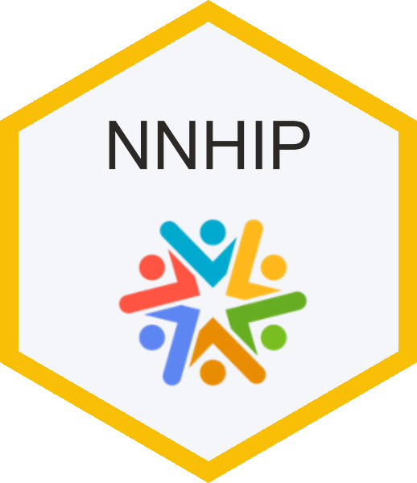

<!-- README.md is generated from README.Rmd. Please edit that file -->

```{r, include = FALSE}
knitr::opts_chunk$set(
  collapse = TRUE,
  comment = "#>"
)
```



# National Neighbourhood Health Improvement Programme (NNHIP)

<!-- badges: start -->

[](LICENSE) 

<!-- badges: end -->

This repository contains the code and supporting materials used to process data for the **National Neighbourhood Improvement Programme (NNHIP)**[^1]. It supports two main workflows:

[^1]: For an introduction to what neighbourhood health involves, please see: <https://www.strategyunitwm.nhs.uk/news/strategy-unit-contribution-neighbourhood-health>, and for a review of the evidence supporting neighbourhood working, please see: <https://www.strategyunitwm.nhs.uk/sites/default/files/2025-10/Evidence%20briefing_What%20is%20neighbourhood%20working_FINAL_0.pdf>

1.  **Monthly aggregate data processing**

    This workflow ingests and validates monthly aggregate submissions from participating Places. The processed data is used to generate a *balanced scorecard*, providing a Place-level overview of NNHIP implementation and performance.

    Key activities include:

    -   Data ingestion and validation

    -   Quality checks (completeness, consistency, outliers)

    -   Transformation and aggregation

    -   Scorecared metric generation

2.  **Survey - UDAL data linkage**

    This workflow links survey responses with hospital and community-based datasets held within the **Unified Data Access Layer (UDAL)**.[^2] The linked dataset is used to produce a de-identified, patient-level dashboard that supports monitoring, evaluation and insight generation.

    Key activities include:

    -   Secure extraction of survey data

    -   Linkage with UDAL datasets

    -   Preparation of dashboard-ready datasets

[^2]: A secure platform which enables access to de-identified information from a range of healthcare datasets. For more information on the UDAL platform, please see: <https://www.england.nhs.uk/contact-us/privacy-notice/data-analytics/>

## Usage

Before running any of the workflows in this project, make sure the required R packages are installed. You can install all dependencies in one step:

```{r}
#| eval: false
devtools::install_deps()
```

Once dependencies are installed, you can run the scripts in the R/ directory as needed for data processing and analysis.
